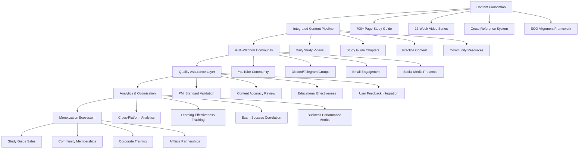

# Design Document

## Overview

The PMP Certification Preparation Ecosystem is designed as an integrated educational platform that transforms PMP exam preparation from an expensive, fragmented experience into an accessible, comprehensive learning system. The platform combines a 700+ page ECO-focused study guide with a structured 13-week YouTube video series, multi-platform community engagement, and automated content management systems.

The design follows a holistic approach: establishing credibility through authentic positioning and professional content, delivering consistent value through integrated written and video materials, building engaged communities across multiple platforms, implementing robust quality assurance for educational accuracy, and creating sustainable monetization through diverse revenue streams. This creates a scalable business model that serves learners while maintaining educational integrity and community focus.

Key architectural principles include content integration across formats, educational quality assurance aligned with PMI standards, multi-platform community management, comprehensive analytics for learning effectiveness, and flexible business model adaptation based on community feedback and market evolution.

## Architecture

### Content Architecture



### Technical Infrastructure

The system operates as an integrated ecosystem spanning multiple platforms with sophisticated content management and quality assurance capabilities:

- **Content Management System**: Centralized hub for study guide and video content with cross-reference tracking
- **Multi-Platform Publishing**: YouTube Studio, study guide distribution, community platform integration
- **Quality Assurance Pipeline**: PMI standard validation, content accuracy checking, educational effectiveness measurement
- **Community Management Platform**: Unified management across YouTube, Discord/Telegram, email, and social media
- **Analytics and Learning Platform**: Cross-platform engagement tracking, learning effectiveness measurement, exam success correlation
- **Business Intelligence System**: Revenue tracking, conversion analysis, customer lifetime value calculation
- **Content Synchronization Engine**: Automated alignment between study guide updates and video content

### Information Architecture

Content is organized as an integrated learning ecosystem supporting multiple learning styles and access patterns:

1. **Integrated Study Paths**: 
   - Sequential 13-week program with study guide and video alignment
   - Domain-specific deep dives: People (42%), Process (50%), Business Environment (8%)
   - Flexible access patterns for different learning preferences

2. **Cross-Referenced Content Structure**:
   - Study guide chapters with embedded video callouts
   - Video descriptions with study guide page references
   - Practice content aligned across both formats

3. **Multi-Platform Community Hub**:
   - YouTube community posts and comments
   - Discord/Telegram study groups with topic channels
   - Email sequences with progress tracking
   - Social media engagement and success stories

4. **Quality Assurance Framework**:
   - PMI standard compliance tracking
   - Content accuracy validation system
   - User feedback integration and improvement cycles
   - Educational effectiveness measurement and optimization

## Components and Interfaces

### Content Creation Components

**Video Template System**
- Daily Study Videos (15-20 min): Standardized format with intro, objectives, ECO mapping, content, practice, recap
- Weekly Deep Dives (30-45 min): Comprehensive topic exploration with multiple scenarios
- YouTube Shorts (60 sec): Quick tips, mindset moments, common mistakes
- Practice Sessions: Scenario-based questions with detailed explanations

**Branding System**
- Visual Identity: Professional color scheme (blues/greens), consistent typography
- Thumbnail Templates: Week/day numbers, personal branding, contrasting colors
- Channel Assets: Banner design, playlist covers, end screen templates
- Content Overlays: Lower thirds, progress indicators, call-to-action graphics

### Community Engagement Components

**Interaction Management System**
- Comment Response Protocol: 2-hour response time during first 3 months
- Welcome Automation: Pinned comments with study tips on every video
- Progress Tracking: Weekly check-ins and milestone celebrations
- Live Interaction: Monthly Q&A sessions with real-time engagement

**Lead Generation System**
- Content Upgrades: Study calendars, cheat sheets, question banks
- Email Capture: Embedded forms in video descriptions and community posts
- Social Proof Collection: Success stories, testimonials, progress updates
- Cross-Platform Integration: Facebook groups, LinkedIn networking, email sequences

### SEO and Discovery Components

**Keyword Optimization System**
- Primary Keywords: "PMP exam prep", "PMP certification study guide", "PMP exam 2024"
- Long-tail Variations: "13-week PMP study plan", "PMP practice questions", "project management certification"
- Title Formulas: Day-specific, topic-focused, benefit-driven structures
- Description Templates: Keyword-rich, timestamped, call-to-action included

**Content Distribution Strategy**
- Upload Schedule: Daily during 13-week cycles, consistent timing
- Cross-Promotion: Shorts driving traffic to long-form content
- Playlist Optimization: Sequential viewing, topic clustering
- External Promotion: LinkedIn articles, Facebook groups, email marketing

## Data Models

### Content Metadata Model

```
Video {
  id: string
  title: string
  description: string
  duration: number
  week: number
  day: number
  ecoTasks: string[]
  keywords: string[]
  thumbnailUrl: string
  uploadDate: date
  viewCount: number
  engagementRate: number
}

Playlist {
  id: string
  name: string
  description: string
  videoIds: string[]
  category: enum[study-plan, domain, practice, mindset]
  orderIndex: number
}
```

### User Engagement Model

```
Subscriber {
  id: string
  subscribeDate: date
  engagementLevel: enum[low, medium, high]
  studyWeek: number
  emailSubscribed: boolean
  leadMagnetsDownloaded: string[]
  commentsCount: number
  watchTimeMinutes: number
}

Comment {
  id: string
  videoId: string
  userId: string
  content: string
  timestamp: date
  responseTime: number
  sentiment: enum[positive, neutral, negative]
}
```

### Performance Metrics Model

```
ChannelMetrics {
  date: date
  subscribers: number
  totalViews: number
  watchTimeHours: number
  averageViewDuration: number
  clickThroughRate: number
  engagementRate: number
  revenue: number
  emailSubscribers: number
}

VideoMetrics {
  videoId: string
  date: date
  views: number
  likes: number
  comments: number
  shares: number
  watchTimePercentage: number
  clickThroughRate: number
  subscribersGained: number
}
```

## Error Handling

### Content Production Issues

**Recording Failures**
- Backup equipment ready (secondary camera, microphone)
- Cloud storage for immediate backup of recordings
- Template scripts for quick re-recording
- Buffer content for emergency situations

**Upload Problems**
- Scheduled uploads 1-2 days in advance
- Multiple format exports for compatibility
- Backup upload locations (Google Drive, Dropbox)
- Mobile upload capability for emergencies

**SEO and Discovery Issues**
- Keyword research validation before content creation
- A/B testing for titles and thumbnails
- Performance monitoring with quick pivot strategies
- Backup content topics for trending opportunities

### Community Management Issues

**Negative Feedback Handling**
- Response templates for common concerns
- Escalation procedures for serious issues
- Community guidelines clearly posted
- Moderation tools and blocked user management

**Engagement Drop-offs**
- Early warning metrics (view duration, comment rates)
- Content pivot strategies based on performance data
- Re-engagement campaigns for inactive subscribers
- Community polls for content direction feedback

### Technical Platform Issues

**YouTube Platform Changes**
- Algorithm update monitoring and adaptation strategies
- Multiple traffic sources (search, suggested, external)
- Platform diversification planning (email, social media)
- Content backup and migration procedures

**Monetization Disruptions**
- Multiple revenue streams to reduce platform dependency
- Direct sales capabilities independent of YouTube
- Email list as owned audience asset
- Corporate partnership development for stability

## Testing Strategy

### Content Performance Testing

**A/B Testing Framework**
- Thumbnail variations (2-3 options per video)
- Title testing for click-through optimization
- Upload timing experiments for maximum reach
- Content format testing (length, structure, style)

**Engagement Testing**
- Comment response time impact on engagement
- Community post frequency optimization
- Live session timing and format testing
- Email campaign performance measurement

### User Experience Testing

**Learning Effectiveness Validation**
- Progress tracking through community feedback
- Practice question performance correlation
- Exam pass rate tracking for subscribers
- Content comprehension surveys

**Navigation and Discovery Testing**
- Playlist organization effectiveness
- Search result positioning monitoring
- Suggested video algorithm performance
- Cross-video navigation flow analysis

### Business Model Validation

**Monetization Testing**
- Lead magnet conversion rate optimization
- Email to course sales funnel performance
- Affiliate partnership revenue tracking
- Corporate training inquiry conversion rates

**Growth Metrics Validation**
- Subscriber growth rate sustainability
- Watch time retention improvement
- Revenue per subscriber optimization
- Customer lifetime value calculation

### Quality Assurance Process

**Pre-Publication Checklist**
- Content accuracy review against PMI standards
- Audio/video quality verification
- SEO optimization confirmation
- Thumbnail and title approval
- Description and tags validation

**Post-Publication Monitoring**
- First 24-hour performance tracking
- Comment moderation and response
- Engagement rate analysis
- Technical issue identification and resolution

**Monthly Performance Review**
- Content performance analysis
- Community growth assessment
- Revenue tracking and forecasting
- Strategy adjustment recommendations