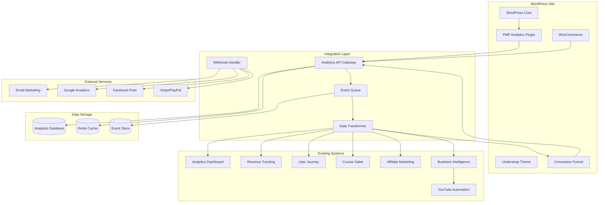
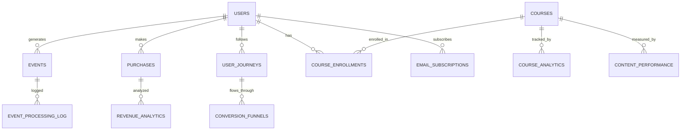

# WordPress Website Integration Design

## Overview

This design document outlines the technical architecture and implementation approach for integrating the PMP Course WordPress website with our comprehensive analytics and automation ecosystem. The integration will create a unified data flow between the WordPress site, existing analytics systems, YouTube automation, and business intelligence platforms.

The design follows a microservices architecture with event-driven communication, ensuring scalability, maintainability, and real-time data processing capabilities.

## Architecture

### High-Level System Architecture



### Component Architecture

#### WordPress Integration Components

1. **PMP Analytics Plugin**
   - Custom WordPress plugin for event tracking
   - Hooks into WordPress actions and filters
   - Handles data collection and transmission
   - Manages user consent and privacy settings

2. **Theme Integration Layer**
   - Custom JavaScript for frontend tracking
   - PHP hooks for backend event capture
   - Form submission handlers
   - E-commerce event tracking

3. **API Client Library**
   - Handles communication with Analytics API
   - Implements retry logic and error handling
   - Manages authentication and rate limiting
   - Provides offline queue capabilities

#### Integration Layer Components

1. **Analytics API Gateway**
   - RESTful API for receiving WordPress events
   - Authentication and authorization
   - Rate limiting and request validation
   - Event routing and transformation

2. **Event Processing Pipeline**
   - Asynchronous event queue (Redis/RabbitMQ)
   - Event transformation and enrichment
   - Duplicate detection and deduplication
   - Error handling and retry mechanisms

3. **Data Synchronization Service**
   - Bi-directional data sync between systems
   - Conflict resolution and data consistency
   - Batch processing for historical data
   - Real-time streaming for live events

## Components and Interfaces

### WordPress Plugin Architecture

```php
class PMP_Analytics_Plugin {
    private $api_client;
    private $event_queue;
    private $config;
    
    public function __construct() {
        $this->api_client = new PMP_API_Client();
        $this->event_queue = new PMP_Event_Queue();
        $this->config = new PMP_Config();
    }
    
    // Event tracking methods
    public function track_page_view($data);
    public function track_user_action($action, $data);
    public function track_conversion($type, $data);
    public function track_purchase($order_data);
    
    // WordPress hooks
    public function init_hooks();
    public function handle_user_registration($user_id);
    public function handle_course_enrollment($user_id, $course_id);
    public function handle_woocommerce_purchase($order_id);
}
```

### API Gateway Interface

```javascript
// REST API Endpoints
POST /api/v1/events/track
POST /api/v1/events/batch
POST /api/v1/users/register
POST /api/v1/purchases/track
POST /api/v1/conversions/track
POST /api/v1/journey/touchpoint

GET /api/v1/analytics/dashboard
GET /api/v1/analytics/reports
GET /api/v1/users/{id}/journey
GET /api/v1/courses/{id}/performance

// WebSocket for real-time updates
WS /api/v1/realtime/events
WS /api/v1/realtime/dashboard
```

### Event Schema Definitions

```json
{
  "page_view_event": {
    "id": "string",
    "timestamp": "ISO8601",
    "user_id": "string|null",
    "session_id": "string",
    "page_url": "string",
    "page_title": "string",
    "referrer": "string",
    "utm_parameters": {
      "source": "string",
      "medium": "string",
      "campaign": "string",
      "term": "string",
      "content": "string"
    },
    "user_agent": "string",
    "ip_address": "string",
    "metadata": "object"
  },
  
  "purchase_event": {
    "id": "string",
    "timestamp": "ISO8601",
    "user_id": "string",
    "order_id": "string",
    "product_id": "string",
    "product_name": "string",
    "amount": "number",
    "currency": "string",
    "payment_method": "string",
    "billing_address": "object",
    "utm_parameters": "object",
    "metadata": "object"
  },
  
  "user_journey_event": {
    "id": "string",
    "timestamp": "ISO8601",
    "user_id": "string",
    "session_id": "string",
    "stage": "string",
    "action": "string",
    "touchpoint": "string",
    "source": "string",
    "value": "number|null",
    "metadata": "object"
  }
}
```

## Data Models

### Core Data Entities

#### User Entity
```sql
CREATE TABLE users (
    id VARCHAR(255) PRIMARY KEY,
    wordpress_id BIGINT UNIQUE,
    email VARCHAR(255) NOT NULL,
    first_name VARCHAR(100),
    last_name VARCHAR(100),
    registration_date DATETIME,
    last_login DATETIME,
    user_type ENUM('prospect', 'lead', 'customer', 'subscriber'),
    lifetime_value DECIMAL(10,2) DEFAULT 0,
    utm_attribution JSON,
    preferences JSON,
    created_at TIMESTAMP DEFAULT CURRENT_TIMESTAMP,
    updated_at TIMESTAMP DEFAULT CURRENT_TIMESTAMP ON UPDATE CURRENT_TIMESTAMP,
    
    INDEX idx_email (email),
    INDEX idx_wordpress_id (wordpress_id),
    INDEX idx_user_type (user_type),
    INDEX idx_registration_date (registration_date)
);
```

#### Event Entity
```sql
CREATE TABLE events (
    id VARCHAR(255) PRIMARY KEY,
    timestamp DATETIME NOT NULL,
    user_id VARCHAR(255),
    session_id VARCHAR(255),
    event_type VARCHAR(100) NOT NULL,
    event_category VARCHAR(50),
    platform VARCHAR(50) DEFAULT 'wordpress',
    source VARCHAR(100),
    page_url TEXT,
    referrer TEXT,
    utm_parameters JSON,
    event_data JSON,
    processed BOOLEAN DEFAULT FALSE,
    created_at TIMESTAMP DEFAULT CURRENT_TIMESTAMP,
    
    INDEX idx_user_id (user_id),
    INDEX idx_session_id (session_id),
    INDEX idx_event_type (event_type),
    INDEX idx_timestamp (timestamp),
    INDEX idx_platform (platform),
    INDEX idx_processed (processed),
    
    FOREIGN KEY (user_id) REFERENCES users(id) ON DELETE SET NULL
);
```

#### Purchase Entity
```sql
CREATE TABLE purchases (
    id VARCHAR(255) PRIMARY KEY,
    timestamp DATETIME NOT NULL,
    user_id VARCHAR(255) NOT NULL,
    wordpress_order_id BIGINT,
    product_id VARCHAR(100),
    product_name VARCHAR(255),
    product_type ENUM('course', 'guide', 'membership', 'other'),
    amount DECIMAL(10,2) NOT NULL,
    currency VARCHAR(3) DEFAULT 'USD',
    payment_method VARCHAR(50),
    payment_status ENUM('pending', 'completed', 'failed', 'refunded'),
    utm_attribution JSON,
    billing_data JSON,
    metadata JSON,
    created_at TIMESTAMP DEFAULT CURRENT_TIMESTAMP,
    updated_at TIMESTAMP DEFAULT CURRENT_TIMESTAMP ON UPDATE CURRENT_TIMESTAMP,
    
    INDEX idx_user_id (user_id),
    INDEX idx_timestamp (timestamp),
    INDEX idx_product_type (product_type),
    INDEX idx_payment_status (payment_status),
    INDEX idx_wordpress_order_id (wordpress_order_id),
    
    FOREIGN KEY (user_id) REFERENCES users(id) ON DELETE CASCADE
);
```

#### User Journey Entity
```sql
CREATE TABLE user_journeys (
    id VARCHAR(255) PRIMARY KEY,
    user_id VARCHAR(255) NOT NULL,
    session_id VARCHAR(255),
    stage VARCHAR(50) NOT NULL,
    touchpoint VARCHAR(100) NOT NULL,
    timestamp DATETIME NOT NULL,
    source VARCHAR(100),
    medium VARCHAR(100),
    campaign VARCHAR(100),
    page_url TEXT,
    action_taken VARCHAR(100),
    value_generated DECIMAL(10,2) DEFAULT 0,
    time_spent INTEGER DEFAULT 0,
    metadata JSON,
    created_at TIMESTAMP DEFAULT CURRENT_TIMESTAMP,
    
    INDEX idx_user_id (user_id),
    INDEX idx_session_id (session_id),
    INDEX idx_stage (stage),
    INDEX idx_timestamp (timestamp),
    INDEX idx_touchpoint (touchpoint),
    
    FOREIGN KEY (user_id) REFERENCES users(id) ON DELETE CASCADE
);
```

### Data Relationships



## Error Handling

### Error Classification and Response Strategy

#### 1. Network and Connectivity Errors
```javascript
class NetworkErrorHandler {
    constructor() {
        this.retryAttempts = 3;
        this.backoffMultiplier = 2;
        this.maxBackoffTime = 30000; // 30 seconds
    }
    
    async handleNetworkError(error, attempt = 1) {
        if (attempt > this.retryAttempts) {
            // Store in local queue for later retry
            await this.queueForLaterRetry(error.request);
            return;
        }
        
        const backoffTime = Math.min(
            1000 * Math.pow(this.backoffMultiplier, attempt - 1),
            this.maxBackoffTime
        );
        
        await this.delay(backoffTime);
        return this.retryRequest(error.request, attempt + 1);
    }
}
```

#### 2. Data Validation Errors
```php
class DataValidationHandler {
    public function validateEvent($eventData) {
        $errors = [];
        
        // Required fields validation
        if (empty($eventData['timestamp'])) {
            $errors[] = 'Timestamp is required';
        }
        
        if (empty($eventData['event_type'])) {
            $errors[] = 'Event type is required';
        }
        
        // Data format validation
        if (!$this->isValidTimestamp($eventData['timestamp'])) {
            $errors[] = 'Invalid timestamp format';
        }
        
        if (!empty($eventData['email']) && !filter_var($eventData['email'], FILTER_VALIDATE_EMAIL)) {
            $errors[] = 'Invalid email format';
        }
        
        return $errors;
    }
    
    public function sanitizeEventData($eventData) {
        // Remove potentially harmful data
        $sanitized = array_map(function($value) {
            if (is_string($value)) {
                return sanitize_text_field($value);
            }
            return $value;
        }, $eventData);
        
        return $sanitized;
    }
}
```

#### 3. API Rate Limiting
```javascript
class RateLimitHandler {
    constructor() {
        this.requestQueue = [];
        this.isProcessing = false;
        this.rateLimitDelay = 1000; // 1 second between requests
    }
    
    async queueRequest(request) {
        return new Promise((resolve, reject) => {
            this.requestQueue.push({ request, resolve, reject });
            this.processQueue();
        });
    }
    
    async processQueue() {
        if (this.isProcessing || this.requestQueue.length === 0) {
            return;
        }
        
        this.isProcessing = true;
        
        while (this.requestQueue.length > 0) {
            const { request, resolve, reject } = this.requestQueue.shift();
            
            try {
                const response = await this.makeRequest(request);
                resolve(response);
            } catch (error) {
                if (error.status === 429) {
                    // Rate limited - put request back in queue
                    this.requestQueue.unshift({ request, resolve, reject });
                    await this.delay(this.rateLimitDelay * 2);
                } else {
                    reject(error);
                }
            }
            
            await this.delay(this.rateLimitDelay);
        }
        
        this.isProcessing = false;
    }
}
```

## Testing Strategy

### Unit Testing Approach

#### WordPress Plugin Testing
```php
class PMP_Analytics_Plugin_Test extends WP_UnitTestCase {
    private $plugin;
    
    public function setUp() {
        parent::setUp();
        $this->plugin = new PMP_Analytics_Plugin();
    }
    
    public function test_track_page_view() {
        $data = [
            'page_url' => 'https://example.com/test-page',
            'user_id' => 123,
            'session_id' => 'test-session'
        ];
        
        $result = $this->plugin->track_page_view($data);
        
        $this->assertTrue($result);
        $this->assertEventWasTracked('page_view', $data);
    }
    
    public function test_woocommerce_purchase_tracking() {
        $order_id = $this->create_test_order();
        
        $this->plugin->handle_woocommerce_purchase($order_id);
        
        $this->assertEventWasTracked('purchase', ['order_id' => $order_id]);
    }
    
    private function assertEventWasTracked($event_type, $data) {
        // Verify event was sent to API
        $sent_events = $this->plugin->get_sent_events();
        $this->assertContains($event_type, array_column($sent_events, 'event_type'));
    }
}
```

#### API Integration Testing
```javascript
describe('Analytics API Integration', () => {
    let apiClient;
    
    beforeEach(() => {
        apiClient = new AnalyticsAPIClient({
            endpoint: 'http://localhost:3000/api',
            apiKey: 'test-key'
        });
    });
    
    test('should track page view event', async () => {
        const eventData = {
            event_type: 'page_view',
            page_url: 'https://example.com/test',
            user_id: 'test-user-123',
            timestamp: new Date().toISOString()
        };
        
        const response = await apiClient.trackEvent(eventData);
        
        expect(response.success).toBe(true);
        expect(response.event_id).toBeDefined();
    });
    
    test('should handle API errors gracefully', async () => {
        // Mock API failure
        jest.spyOn(apiClient, 'makeRequest').mockRejectedValue(new Error('Network error'));
        
        const eventData = { event_type: 'test_event' };
        
        await expect(apiClient.trackEvent(eventData)).rejects.toThrow('Network error');
        
        // Verify event was queued for retry
        expect(apiClient.getQueuedEvents()).toHaveLength(1);
    });
});
```

### Integration Testing

#### End-to-End User Journey Testing
```javascript
describe('Complete User Journey Integration', () => {
    test('should track complete purchase journey', async () => {
        // 1. User visits landing page
        await browser.goto('http://localhost:8080');
        await expect(page).toHaveTitle(/PMP Course/);
        
        // 2. User downloads lead magnet
        await page.fill('#lead-email', 'test@example.com');
        await page.click('#download-btn');
        
        // Verify lead capture event
        const leadEvent = await waitForEvent('lead_capture');
        expect(leadEvent.email).toBe('test@example.com');
        
        // 3. User navigates to pricing page
        await page.click('a[href*="pricing"]');
        
        // Verify page view event
        const pageViewEvent = await waitForEvent('page_view');
        expect(pageViewEvent.page_url).toContain('pricing');
        
        // 4. User completes purchase
        await page.click('.btn-primary'); // Purchase button
        await fillCheckoutForm();
        await page.click('#complete-purchase');
        
        // Verify purchase event
        const purchaseEvent = await waitForEvent('purchase');
        expect(purchaseEvent.amount).toBeGreaterThan(0);
        expect(purchaseEvent.user_id).toBeDefined();
        
        // 5. Verify complete journey is tracked
        const journey = await getUserJourney(purchaseEvent.user_id);
        expect(journey.stages).toContain('awareness');
        expect(journey.stages).toContain('interest');
        expect(journey.stages).toContain('purchase');
    });
});
```

### Performance Testing

#### Load Testing Configuration
```yaml
# k6 load test configuration
scenarios:
  website_traffic:
    executor: ramping-vus
    startVUs: 0
    stages:
      - duration: 2m
        target: 100
      - duration: 5m
        target: 100
      - duration: 2m
        target: 200
      - duration: 5m
        target: 200
      - duration: 2m
        target: 0
    gracefulRampDown: 30s

  api_load:
    executor: constant-arrival-rate
    rate: 1000
    timeUnit: 1s
    duration: 10m
    preAllocatedVUs: 50
    maxVUs: 200

thresholds:
  http_req_duration:
    - p(95) < 2000  # 95% of requests must complete within 2s
  http_req_failed:
    - rate < 0.01   # Error rate must be less than 1%
  checks:
    - rate > 0.99   # 99% of checks must pass
```

## Security Considerations

### Data Protection and Privacy

#### 1. Data Encryption
```php
class DataEncryption {
    private $encryption_key;
    
    public function __construct() {
        $this->encryption_key = get_option('pmp_encryption_key');
        if (!$this->encryption_key) {
            $this->encryption_key = $this->generateEncryptionKey();
            update_option('pmp_encryption_key', $this->encryption_key);
        }
    }
    
    public function encryptPII($data) {
        $sensitive_fields = ['email', 'name', 'phone', 'address'];
        
        foreach ($sensitive_fields as $field) {
            if (isset($data[$field])) {
                $data[$field] = $this->encrypt($data[$field]);
            }
        }
        
        return $data;
    }
    
    private function encrypt($data) {
        $iv = random_bytes(16);
        $encrypted = openssl_encrypt($data, 'AES-256-CBC', $this->encryption_key, 0, $iv);
        return base64_encode($iv . $encrypted);
    }
}
```

#### 2. API Authentication and Authorization
```javascript
class APIAuthentication {
    constructor() {
        this.apiKey = process.env.PMP_API_KEY;
        this.secretKey = process.env.PMP_SECRET_KEY;
    }
    
    generateJWT(payload) {
        return jwt.sign(payload, this.secretKey, {
            expiresIn: '1h',
            issuer: 'pmp-wordpress-integration'
        });
    }
    
    validateRequest(req, res, next) {
        const apiKey = req.headers['x-api-key'];
        const token = req.headers['authorization']?.replace('Bearer ', '');
        
        if (!apiKey || apiKey !== this.apiKey) {
            return res.status(401).json({ error: 'Invalid API key' });
        }
        
        if (!token) {
            return res.status(401).json({ error: 'Missing authorization token' });
        }
        
        try {
            const decoded = jwt.verify(token, this.secretKey);
            req.user = decoded;
            next();
        } catch (error) {
            return res.status(401).json({ error: 'Invalid token' });
        }
    }
    
    rateLimitByUser(req, res, next) {
        const userId = req.user?.id || req.ip;
        const key = `rate_limit:${userId}`;
        
        // Implement rate limiting logic
        // Allow 1000 requests per hour per user
        this.checkRateLimit(key, 1000, 3600)
            .then(allowed => {
                if (allowed) {
                    next();
                } else {
                    res.status(429).json({ error: 'Rate limit exceeded' });
                }
            })
            .catch(next);
    }
}
```

#### 3. GDPR Compliance Implementation
```php
class GDPRCompliance {
    public function handleDataDeletionRequest($user_id) {
        // 1. Delete from WordPress
        $this->deleteWordPressUserData($user_id);
        
        // 2. Delete from analytics systems
        $this->deleteAnalyticsData($user_id);
        
        // 3. Delete from email marketing
        $this->deleteEmailMarketingData($user_id);
        
        // 4. Delete from external services
        $this->deleteExternalServiceData($user_id);
        
        // 5. Log deletion for compliance
        $this->logDataDeletion($user_id);
    }
    
    public function exportUserData($user_id) {
        $data = [
            'wordpress_data' => $this->getWordPressUserData($user_id),
            'analytics_data' => $this->getAnalyticsData($user_id),
            'purchase_history' => $this->getPurchaseHistory($user_id),
            'email_data' => $this->getEmailMarketingData($user_id)
        ];
        
        return $this->formatDataExport($data);
    }
    
    public function getConsentStatus($user_id) {
        return [
            'analytics_tracking' => get_user_meta($user_id, 'consent_analytics', true),
            'marketing_emails' => get_user_meta($user_id, 'consent_marketing', true),
            'third_party_sharing' => get_user_meta($user_id, 'consent_third_party', true)
        ];
    }
}
```

## Deployment Architecture

### Docker-based Development Environment

```yaml
# docker-compose.yml for development
version: '3.8'

services:
  wordpress:
    image: wordpress:6.4-php8.2-apache
    container_name: pmp_wordpress
    environment:
      WORDPRESS_DB_HOST: mysql:3306
      WORDPRESS_DB_NAME: pmp_wordpress
      WORDPRESS_DB_USER: wordpress
      WORDPRESS_DB_PASSWORD: wordpress_password
      WORDPRESS_DEBUG: 1
    volumes:
      - ./understrap-child-1.2.0:/var/www/html/wp-content/themes/understrap-child-1.2.0
      - ./plugins:/var/www/html/wp-content/plugins/custom
      - wordpress_data:/var/www/html
    ports:
      - "8080:80"
    depends_on:
      - mysql
      - redis
    networks:
      - pmp_network

  mysql:
    image: mysql:8.0
    container_name: pmp_mysql
    environment:
      MYSQL_DATABASE: pmp_wordpress
      MYSQL_USER: wordpress
      MYSQL_PASSWORD: wordpress_password
      MYSQL_ROOT_PASSWORD: root_password
    volumes:
      - mysql_data:/var/lib/mysql
      - ./database/init:/docker-entrypoint-initdb.d
    ports:
      - "3306:3306"
    networks:
      - pmp_network

  analytics_api:
    build:
      context: .
      dockerfile: docker/analytics/Dockerfile
    container_name: pmp_analytics_api
    environment:
      NODE_ENV: development
      DB_HOST: mysql
      DB_NAME: pmp_analytics
      REDIS_URL: redis://redis:6379
    volumes:
      - ./src:/app/src
    ports:
      - "3000:3000"
    depends_on:
      - mysql
      - redis
    networks:
      - pmp_network

  redis:
    image: redis:7-alpine
    container_name: pmp_redis
    ports:
      - "6379:6379"
    volumes:
      - redis_data:/data
    networks:
      - pmp_network

  nginx:
    image: nginx:alpine
    container_name: pmp_nginx
    ports:
      - "80:80"
      - "443:443"
    volumes:
      - ./nginx/nginx.conf:/etc/nginx/nginx.conf
      - ./nginx/sites:/etc/nginx/conf.d
    depends_on:
      - wordpress
      - analytics_api
    networks:
      - pmp_network

volumes:
  wordpress_data:
  mysql_data:
  redis_data:

networks:
  pmp_network:
    driver: bridge
```

### Production Deployment Strategy

#### 1. Infrastructure as Code (Terraform)
```hcl
# main.tf
provider "aws" {
  region = var.aws_region
}

# ECS Cluster for containerized services
resource "aws_ecs_cluster" "pmp_cluster" {
  name = "pmp-integration-cluster"
  
  setting {
    name  = "containerInsights"
    value = "enabled"
  }
}

# RDS for WordPress and Analytics databases
resource "aws_db_instance" "pmp_database" {
  identifier = "pmp-database"
  engine     = "mysql"
  engine_version = "8.0"
  instance_class = "db.t3.medium"
  allocated_storage = 100
  storage_encrypted = true
  
  db_name  = "pmp_wordpress"
  username = var.db_username
  password = var.db_password
  
  vpc_security_group_ids = [aws_security_group.database.id]
  db_subnet_group_name   = aws_db_subnet_group.pmp_db_subnet_group.name
  
  backup_retention_period = 7
  backup_window          = "03:00-04:00"
  maintenance_window     = "sun:04:00-sun:05:00"
  
  skip_final_snapshot = false
  final_snapshot_identifier = "pmp-database-final-snapshot"
  
  tags = {
    Name = "PMP Integration Database"
    Environment = var.environment
  }
}

# ElastiCache for Redis
resource "aws_elasticache_cluster" "pmp_redis" {
  cluster_id           = "pmp-redis"
  engine               = "redis"
  node_type            = "cache.t3.micro"
  num_cache_nodes      = 1
  parameter_group_name = "default.redis7"
  port                 = 6379
  subnet_group_name    = aws_elasticache_subnet_group.pmp_cache_subnet.name
  security_group_ids   = [aws_security_group.cache.id]
  
  tags = {
    Name = "PMP Integration Cache"
    Environment = var.environment
  }
}
```

#### 2. CI/CD Pipeline (GitHub Actions)
```yaml
# .github/workflows/deploy.yml
name: Deploy PMP Integration

on:
  push:
    branches: [main]
  pull_request:
    branches: [main]

jobs:
  test:
    runs-on: ubuntu-latest
    
    services:
      mysql:
        image: mysql:8.0
        env:
          MYSQL_ROOT_PASSWORD: root
          MYSQL_DATABASE: test_db
        options: >-
          --health-cmd="mysqladmin ping"
          --health-interval=10s
          --health-timeout=5s
          --health-retries=3
      
      redis:
        image: redis:7-alpine
        options: >-
          --health-cmd="redis-cli ping"
          --health-interval=10s
          --health-timeout=5s
          --health-retries=3
    
    steps:
    - uses: actions/checkout@v3
    
    - name: Setup PHP
      uses: shivammathur/setup-php@v2
      with:
        php-version: '8.2'
        extensions: mysqli, pdo_mysql
    
    - name: Setup Node.js
      uses: actions/setup-node@v3
      with:
        node-version: '18'
        cache: 'npm'
    
    - name: Install PHP dependencies
      run: composer install --no-dev --optimize-autoloader
    
    - name: Install Node.js dependencies
      run: npm ci
    
    - name: Run PHP tests
      run: vendor/bin/phpunit
    
    - name: Run JavaScript tests
      run: npm test
    
    - name: Run integration tests
      run: npm run test:integration

  deploy:
    needs: test
    runs-on: ubuntu-latest
    if: github.ref == 'refs/heads/main'
    
    steps:
    - uses: actions/checkout@v3
    
    - name: Configure AWS credentials
      uses: aws-actions/configure-aws-credentials@v2
      with:
        aws-access-key-id: ${{ secrets.AWS_ACCESS_KEY_ID }}
        aws-secret-access-key: ${{ secrets.AWS_SECRET_ACCESS_KEY }}
        aws-region: us-east-1
    
    - name: Build and push Docker images
      run: |
        docker build -t pmp-analytics-api:${{ github.sha }} .
        docker tag pmp-analytics-api:${{ github.sha }} ${{ secrets.ECR_REGISTRY }}/pmp-analytics-api:${{ github.sha }}
        docker push ${{ secrets.ECR_REGISTRY }}/pmp-analytics-api:${{ github.sha }}
    
    - name: Deploy to ECS
      run: |
        aws ecs update-service \
          --cluster pmp-integration-cluster \
          --service pmp-analytics-api \
          --force-new-deployment
```

This comprehensive design provides a robust, scalable, and maintainable architecture for integrating the WordPress website with our existing analytics and automation systems. The design emphasizes security, performance, and real-time data processing while maintaining flexibility for future enhancements.